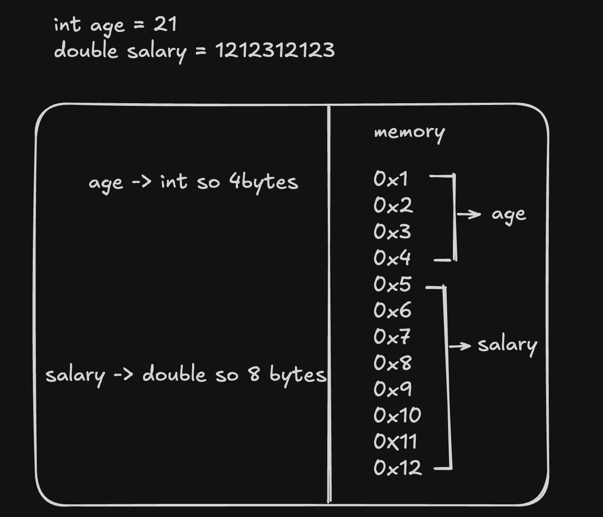
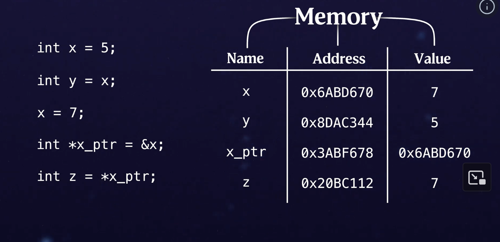

# C-Recap

Init this repo to just recap my c learnings and also to learn more about memory this time, how it stores different things
like functions, variables etc on the hardware level.

## Datatypes

 * int - An integer.
 * float - Rational numbers(decimal numbers).
 * char - Character(A | B | c | d etc).
 * char* - Array of characters(string).

 NOTE: In C, the memory/size of each datatypes varies based on the operating system architecture(64|32 bit).
- int: 8bytes
- char: 1byte
- float: 4bytes
- double: 8bytes
 `1byte = 8bits`
 To know a datatype size you can use `sizeof` operator, also  there is a special datatype called `size_t`
 this is mostly used to know the sizeof `size_t size = sizeof(int)`, technically here u can also use int,
 but if ur data structure exceeds range of int from the sizeof, then int may not be the perfect solution.

## Format specifiers
    
 Unlike js|python, in C you need to specify the format specifier based on the datatype,
 * %d - for int.
 * %f - for float.
 * %c - for char.
 * %s - for char*.
 * %p - for printing memory address.
 * %zu - for sizeof.
 EG: `printf("%d", int_variable)`


## Structs

 In c Structs are something similar to objects/classes that are in python/js, unlike things like inheritance, abstract classes etc
structs are simply objects that contain multiple datatypes.
 Unlike objects in js/python the datatypes in C structs are ordered, meaning it assigns a set of block and assign
each datatype next by next.

EG: In the below example `age, fullName` are next to next block in the memory.
```C
struct Emp {
  int age;
  char *fullName;
}
```
 To initialize struct, there are multiple ways.

way1:
```C
struct Emp emp = { 21, "Manikandan Arjunan" };

```

way2:
```C
struct Emp emp = {
    .age = 21,
    .fullName = "Manikandan Arjunan"
};

```

in way1, if the ordering changed for some reason, u need to change ur initialization again(as i said struct in c is
ordered along with memory by placing data types next in the block),

## Pointer
    This is an important concept in c, and this is why i decided to recap c ->
memory -> Memory is a phsical location on our computer(could be ram or rom), ram is kinda temproary if u turn of ur system it will belost
and resetted, rom is permanent forever, but ram is kinda faster than rom, whenever we declare variables, it will take some 
memory based on the datatype size, see below




From the above image if u can see, thats how every functions, variables etc will be placed inside the memory, and all
the things that u see like (0x1, 0x2 etc) are memory addresses and it will be represent in hexadecimal to save some spaces.

### Virtual Memory
 Virtual memory is just an abstraction to our actual physical memory(RAM) that our operating system provides for simplicity
security(so that applications don't mess with actual physical memory).

Now coming to what is pointer? - A pointer is just a variable which holds a value of memory addresses. pointer variables are
usually prepended by *, size of pointer variable will always be same(coz end of the day for any data type, pointer
variable holds the memory)
for EG: `int a = 10; int *aAddress = &a`, & is the address of operator, which gives the memory address of any variable.



## Array
 As we know array are a block of stuffs with similar datatypes, in C array and pointer are closely related(also in every other
 language, just we dont see it), if we declare an array in C(or any language) `int arr[3] = {2,3,4}`,
 if u see we have declared an array of size 3 for int datatype. The variable arr doesn't actually hold the entire array value
 instead it holds the pointer to the first value of the array(2), for eg: lets say this 2,3,4 recides in 0x1, 0x4, 0x8
 arr variable holds 0x1, now whenever u do arr[0], it basically does arr + (datatype_size * index).

    * arr[0]: 0x1 + (4 * 0) -> 0x1
    * arr[1]: 0x1 + (4 * 1) -> 0x4
    * arr[2]: 0x1 + (4 * 2) -> 0x8

 Now you know why arrays are using 0 as starting index.

## Strings
 Strings in c are represented as `char *variable`, meaning this same as arrays to pointer.


## Enums
 Enums are kinda constants variable with value for EG:
```C
ENUM WeekDay (
    MONDAY,
    TUESDAY,
    ...
    SUNDAY
)
```

## Malloc
 This is the core thing in which c used to create a memory space. below will basically 
creates 40bytes of contigous memory and give the first location to u(kinda dynamic array).
```C
int *memi = (int*)malloc(10 * sizeof(int))
```

## Pointers to pointers
 As we already know pointer is a variable that holds the memory address of another variable,
```C
    int a = 10;
    int* aPtr = &a;// aPtr holds the address of a
```
pointers to pointers basically holds the memory address of another pointer, something like below
```C
    int a = 10;
    int aPtr = &a;
    int aPtrPtr = &aPtrPatr; // **aPtrPtr dereference the original a value 10;
```

## Array pointers
 Array of pointers is basically pointer array where the values of array contains pointers.
a good example would be array of strings.


